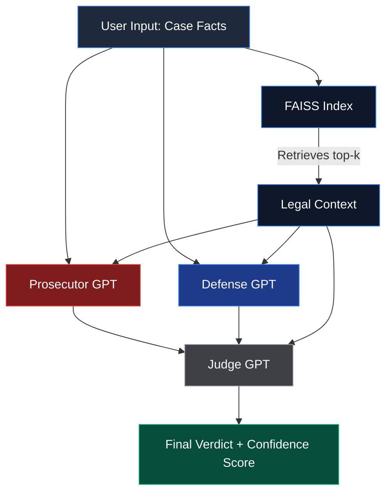

<<<<<<< HEAD
# ⚖️ AI Courtroom Simulation

A minimal AI-powered courtroom simulation that orchestrates **three GPT agents** — Prosecutor, Defense Attorney, and Judge — with a **basic RAG pipeline** that retrieves relevant legal principles to ground every argument.

---

## 🤖 Agents

| Agent | Role | Temperature |
|---|---|---|
| **Prosecutor GPT** | Argues the defendant is GUILTY | 0.75 |
| **Defense GPT** | Argues the defendant is NOT GUILTY | 0.75 |
| **Judge GPT** | Evaluates both sides, delivers verdict + confidence score | 0.3 |

Each agent has a distinct system prompt that defines its persona, objectives, and a strict structured output format.

---

## 🏛️ Architecture & Flow



## 💡 Why I Built This

I built this courtroom simulation to demonstrate my ability to orchestrate complex Multi-Agent AI systems using the OpenAI API. Instead of a standard one-shot prompt, this system requires dynamic interactions where agents analyze and react to each other's outputs. 

**Technical Challenges Solved:**
1. **Agent Coordination:** Ensuring the Judge GPT waits for and properly evaluates the isolated arguments of the Prosecution and Defense.
2. **Context Grounding (RAG):** Preventing hallucination by injecting immutable, retrieved specific legal principles into all agents' prompts using `FAISS` and `sentence-transformers`.
3. **Structured Output:** Strictly adhering to desired format structures through robust prompt engineering.

---

## 📚 RAG Pipeline

- **Corpus**: 15 hand-crafted legal principles (extensible in `rag.py`)
- **Embeddings**: `all-MiniLM-L6-v2` via `sentence-transformers`
- **Index**: FAISS flat inner-product index (cosine similarity on L2-normalised vectors)
- **Retrieval**: Top-k passages (default `k=4`) injected into every agent prompt

---

## 🗂️ Project Structure

```
AI Courtroom/
├── app.py           # Streamlit Web User Interface
├── agents.py        # Prosecutor, Defense, Judge GPT agents
├── rag.py           # RAG retriever (FAISS + sentence-transformers)
├── courtroom.py     # Main trial orchestration pipeline + CLI
├── requirements.txt # Python dependencies
├── .env.example     # Environment variable template
└── README.md
```

---

## 🚀 Quick Start

### 1. Clone & install

```bash
git clone https://github.com/jarvis37/mlProjects.git
cd "mlProjects/AI Courtroom"
pip install -r requirements.txt
```

### 2. Configure API key

```bash
cp .env.example .env
# Edit .env and set your OPENAI_API_KEY
```

### 3. Run the Web App

The easiest way to interact with the agents is through the Streamlit interface.

```bash
python -m streamlit run app.py
```

*Alternatively, run the interactive terminal backend script directly via `python courtroom.py`.*

---

## 📋 Example

**Input (demo case):**
```
A man was seen running away from a jewelry store moments after the alarm went
off. Security camera footage shows a person matching his description near the
scene. No stolen items were found on him. He claims he was jogging in the area
and panicked when he heard the alarm.
```

**Output (abbreviated):**
```
======================================================================
  ⚖️  AI COURTROOM SIMULATION  ⚖️
======================================================================

======================================================================
  📚  STEP 1: RAG — Retrieving Legal Context
======================================================================
Retrieved 4 relevant legal principles:
  1. The prosecution must prove guilt beyond a reasonable doubt.
  2. Circumstantial evidence can support a conviction if it is strong ...
  3. Defendants are presumed innocent until proven guilty ...
  4. Flight from the scene may be considered as consciousness of guilt.

...

## Final Verdict
**NOT GUILTY**

## Confidence Score
0.68
```

---

## ⚙️ Configuration

| Variable | Default | Description |
|---|---|---|
| `OPENAI_API_KEY` | *(required)* | Your OpenAI API key |
| `OPENAI_MODEL` | `gpt-4o-mini` | Model to use for all agents |

Change `top_k` in `run_trial()` to retrieve more or fewer legal passages.

---

## 🔧 Extending

- **Add corpus entries**: Edit `LEGAL_CORPUS` in `rag.py`
- **Swap model**: Change `OPENAI_MODEL` in `.env`
- **Add agents**: Follow the pattern in `agents.py` — define a system prompt + a function
- **Swap retriever**: Replace the FAISS index with any vector DB (Chroma, Pinecone, etc.)
=======
# mlProjects
# IPL First Innings Score Predictor

## Project Overview
This project uses Machine Learning to predict the score of an IPL team in the first innings.

## Dataset
I used historical IPL data (2008-2019) containing ball-by-ball information.
- **File:** `ipl.csv`

## How it works
1. Loads the dataset.
2. Filters data for the first innings.
3. Uses algorithms like Linear Regression to predict the final total based on current runs, wickets, and overs.
>>>>>>> 3a723fdbd1c8bb58f756678880c335d13461d907
